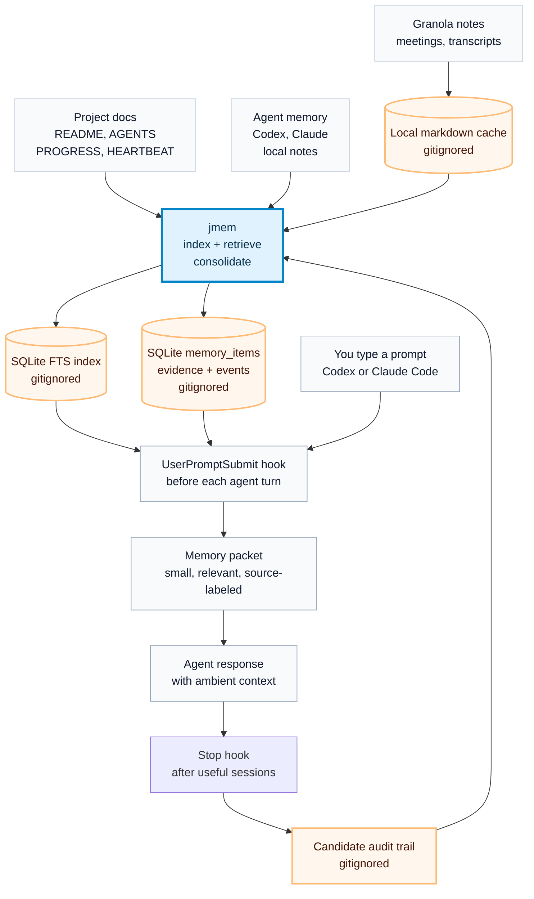

# jmem

jmem is a tiny local memory layer for coding agents. It indexes local source
material, retrieves a small relevant context packet for each prompt, and injects
that packet through Codex or Claude Code `UserPromptSubmit` hooks.

The v0 principle is simple: **broad index, narrow injection**.

- Keep source files where they already live.
- Cache sensitive external sources locally only when needed for fast retrieval.
- Store generated indexes, logs, and meeting-note caches outside git.
- Inject source-labeled snippets, not a giant second-brain dump.
- Make retrieval observable before making memory smarter.
- Keep extracted memory in SQLite; Markdown is only a generated local view.

## How jmem Works

jmem keeps your real files where they are, builds a local search index, and
injects only the most relevant snippets before each agent turn.



Refresh behavior:

- **Read-only hooks:** hooks never index or consolidate. A stale index only
  touches a `reindex-requested` marker; all mutation happens in the hourly
  `jmem maintain` LaunchAgent (index refresh, Granola sync, LLM
  consolidation, candidate pruning, log rotation, backups).
- **Relevance gating:** trivial prompts and weak matches get no packet or a
  shrunk packet. Within one session, jmem injects the full packet on the
  first turn and only *new* items on later turns (delta injection).
- **Holdout:** a deterministic 1-in-N of sessions (default 4) receives no
  injection at all, so injected vs uninjected sessions can be compared.
- **Per turn:** each prompt retrieves from the local index; jmem does not
  reread every source live.

## What v0 Does

- Indexes project docs named `AGENTS.md`, `CLAUDE.md`, `README.md`,
  `PROGRESS.md`, `HEARTBEAT.md`, `USER.md`, and `MEMORY.md` under a
  configured projects root.
- Indexes common local agent memory folders when present:
  - `~/.codex/memories/`
  - `~/.codex/automations/`
  - `~/.claude/projects/*/memory/`
  - `~/.clawmail/memory/`
  - `~/.openclaw/memory/notes/`
- Caches and indexes Granola notes through the Granola API when
  `GRANOLA_API_KEY` is configured.
- Injects context into Codex and Claude Code through local hooks.
- Shows what happened with `jmem doctor`, `jmem trace`, and
  `jmem context --explain`.
- Writes candidate audit files from `Stop` hooks and automatically consolidates
  high-confidence durable lines into SQLite `memory_items`.
- Uses local SQLite only. No cloud database, no embeddings, no external service.

## Install

Clone the repo somewhere local:

```bash
git clone https://github.com/jawnty/jmem.git ~/projects/jmem
cd ~/projects/jmem
```

Run directly from the repo:

```bash
./bin/jmem stats
```

Optional local virtualenv install:

```bash
python3 -m venv .venv
. .venv/bin/activate
python -m pip install .
jmem stats
```

## Configure

jmem works with defaults, but these environment variables are available:

```bash
export JMEM_HOME="$HOME/projects/jmem"
export JMEM_PROJECTS_ROOT="$HOME/projects"
export JMEM_GRANOLA_STATE="$HOME/.claude/skills/granola-to-drive/state.json"
export GRANOLA_API_KEY="..."
```

When running directly from a cloned repo, jmem stores generated state under that
repo. When running from an installed package, it stores generated state under
`~/.jmem` unless `JMEM_HOME` is set.

Granola keys are read in this order:

1. `GRANOLA_API_KEY` or `GRANOLA_TOKEN` from the environment
2. `$JMEM_PROJECTS_ROOT/.env`
3. `~/.config/granola/api-key`
4. `~/.config/granola/token`

## Index And Search

```bash
jmem index
jmem stats
jmem search "morning brief heartbeat"
jmem context --cwd "$PWD" --prompt "why did morning brief fail?"
jmem context --cwd "$PWD" --prompt "why did morning brief fail?" --explain
jmem doctor
jmem trace --limit 5
jmem consolidate --dry-run
jmem maintain
jmem backup
jmem config-init
```

Retrieval thresholds, the holdout fraction, judge model, and maintenance
knobs live in `config.toml` (see `jmem config-init` for a commented
template; missing values fall back to defaults).

The context command prints what hooks inject into an agent turn:

```markdown
# jmem Ambient Context

Use this as local memory hints, not guaranteed truth...

## Matching Source Title
- source: project_doc
- path: /path/to/source.md
- snippet: ...
```

## Codex Hook

Install the Codex hooks:

```bash
./scripts/install-hooks --codex
```

Codex may ask you to review or trust the hook with `/hooks`.

The hook command is:

```bash
~/projects/jmem/bin/jmem-codex-hook user-prompt
```

It reads Codex's hook JSON from stdin, runs `jmem context`, and returns
`additionalContext`.

The installer also adds a `Stop` hook:

```bash
~/projects/jmem/bin/jmem-codex-hook stop
```

Stop hooks write candidate audit files under `memory/candidates/` when the hook
event includes useful summary, prompt, response, or transcript text. jmem can
then consolidate high-confidence lines into SQLite automatically.

## Claude Code Hook

Install the Claude Code hooks:

```bash
./scripts/install-hooks --claude
```

Claude Code may ask you to review or trust the hook with `/hooks`.

The hook command is:

```bash
~/projects/jmem/bin/jmem-claude-hook user-prompt
```

Claude Code injects `UserPromptSubmit` hook stdout as context, so this hook
prints the raw `jmem context` packet.

The installer also adds a `Stop` hook:

```bash
~/projects/jmem/bin/jmem-claude-hook stop
```

Claude Code Stop hook events can include transcript paths. jmem reads those when
available, writes candidate audit files under `memory/candidates/`, and can
consolidate high-confidence lines into SQLite automatically.

## Observability

Check whether jmem is healthy:

```bash
jmem doctor
```

Inspect recent hook activity:

```bash
jmem trace --limit 10
jmem trace --limit 10 --json
```

Explain why a prompt retrieves particular snippets:

```bash
jmem context --cwd "$PWD" --prompt "what did we decide about Granola?" --explain
```

The hook log is stored in:

```text
logs/hooks.jsonl
```

That folder is gitignored.

## Memory Candidates

Stop hooks and manual commands write candidate audit files:

```bash
jmem candidates add --cwd "$PWD" --text "Decision: keep writeback ambient."
jmem candidates list
jmem candidates show
jmem candidates accept 1 --bucket preferences
jmem candidates reject 1 --reason "not durable"
jmem candidates prune --days 30 --dry-run
jmem consolidate --dry-run
```

Candidates are stored in:

```text
memory/candidates/
```

That folder is gitignored because candidates can contain private session
details. You normally do not need to review it; it is mainly for debugging.

Consolidation is an LLM pass by default: `jmem maintain` (or
`jmem consolidate`) sends candidate blocks to a Claude CLI judge that emits
zero or more atomic third-person facts per block, rejecting narration,
templates, and one-task noise. The judge subprocess runs with jmem's hooks
disabled twice over (a `--settings` override plus a `JMEM_HOOKS_DISABLED=1`
kill-switch both hook entrypoints honor first) so it can never feed itself,
and with `ANTHROPIC_API_KEY` stripped so it bills the Claude subscription.
If the CLI is unavailable, a stricter regex fallback runs; it never stores
raw text verbatim.

Automatic consolidation writes extracted memories into SQLite first:

```text
memory_items
memory_evidence
memory_events
```

It also generates a local Markdown view:

```text
memory/canon/soft.md
```

That folder is also gitignored. Canon files are local views or manually accepted
memory, not public documentation. Rejected and accepted source candidates are
moved under `memory/candidates/rejected/` and `memory/candidates/accepted/`.

Install the hourly maintainer (replaces the older consolidate and
granola-sync agents; also prunes candidates, rotates logs, and backs up):

```bash
./scripts/install-maintain-launchd --load
```

Backups land in `backups/` (daily DB + canon snapshots, weekly candidates
tarball). Restore with `jmem restore <snapshot.sqlite>`.

## Granola

Sync and index Granola notes:

```bash
jmem granola-sync --index
```

Install the optional hourly macOS LaunchAgent:

```bash
./scripts/install-granola-launchd --load
```

Granola notes are cached in:

```text
memory/granola/
```

That folder is gitignored. It can contain private meeting summaries and
transcripts.

## What Gets Stored

SQLite stores source chunks and metadata:

```text
source
path
title
mtime
sha256
chunk_index
content
```

Examples of `source` values:

- `project_doc`
- `granola_api`
- `codex_memory`
- `codex_automation_memory`
- `claude_memory`
- `clawmail_memory`
- `clawmail_note`
- `openclaw_note`

SQLite also stores extracted working memory:

```text
memory_items:
  text
  kind              # preference, decision, project_fact, correction, todo...
  scope             # global or project:<name>
  status            # soft, canon, rejected, tombstoned
  confidence
  first_seen_at
  last_seen_at
  evidence_count
  source_hash

memory_evidence:
  memory_id
  source_type
  source_path
  source_excerpt

memory_events:
  memory_id
  event_type
  note
```

Retrieval pulls both structured `memory_items` and source snippets. Structured
memory is scoped, confidence-filtered, and source-labeled as `jmem_memory`.

## Safety

The repo ignores generated and sensitive state:

```text
index/
logs/
memory/granola/
memory/candidates/
memory/canon/
```

Run a quick pre-publish scan:

```bash
rg -n "API_KEY|TOKEN|SECRET|Bearer|sk-|ghp_|gho_|AIza|@|/Users/" .
```

More details: [SECURITY.md](SECURITY.md).
