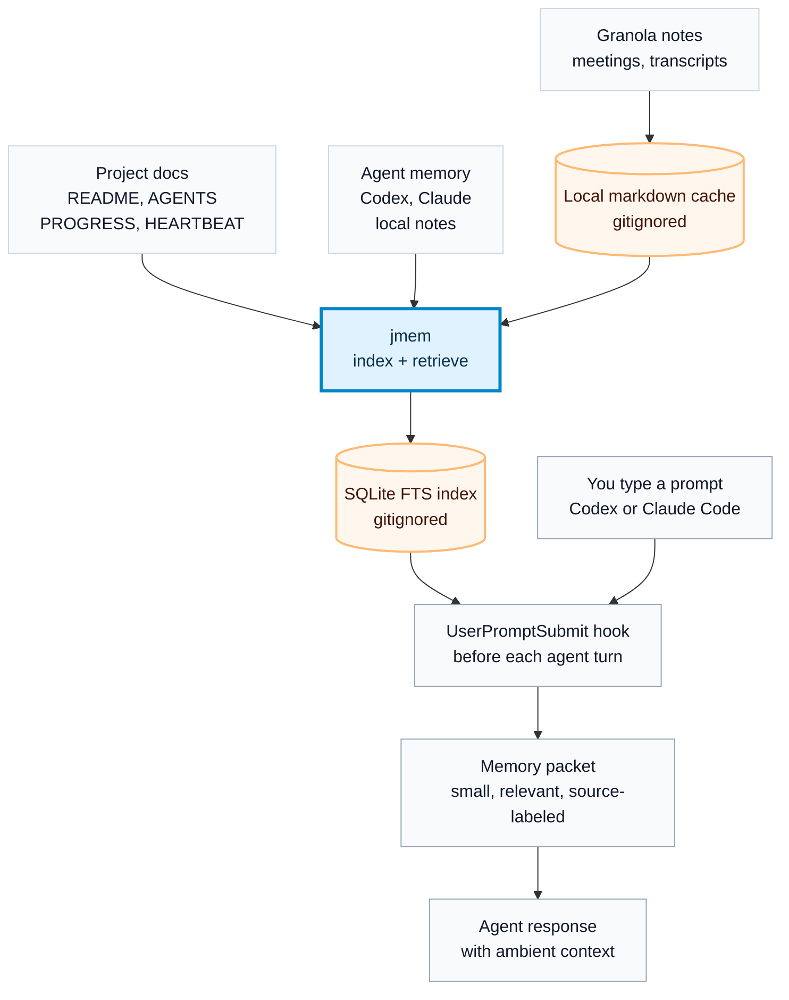

# jmem

jmem is a tiny local memory layer for coding agents. It indexes local source
material, retrieves a small relevant context packet for each prompt, and injects
that packet through Codex or Claude Code `UserPromptSubmit` hooks.

The v0 principle is simple: **broad index, narrow injection**.

- Keep source files where they already live.
- Cache sensitive external sources locally only when needed for fast retrieval.
- Store generated indexes, logs, and meeting-note caches outside git.
- Inject source-labeled snippets, not a giant second-brain dump.

## How jmem Works

jmem keeps your real files where they are, builds a local search index, and
injects only the most relevant snippets before each agent turn.



Refresh behavior:

- **Lazy scan:** project docs and agent memory are scanned when jmem runs, or
  when the index is stale.
- **Auto-poll:** Granola can sync hourly into the gitignored local cache when
  the optional launchd sync is installed.
- **Per turn:** each prompt retrieves from the local index; jmem does not
  reread every source live.

## What v0 Does

- Indexes project docs named `AGENTS.md`, `CLAUDE.md`, `README.md`,
  `PROGRESS.md`, and `HEARTBEAT.md` under a configured projects root.
- Indexes common local agent memory folders when present:
  - `~/.codex/memories/`
  - `~/.codex/automations/`
  - `~/.claude/projects/*/memory/`
  - `~/.clawmail/memory/`
  - `~/.openclaw/memory/notes/`
- Caches and indexes Granola notes through the Granola API when
  `GRANOLA_API_KEY` is configured.
- Injects context into Codex and Claude Code through local hooks.
- Uses SQLite FTS only. No cloud database, no embeddings, no external service.

## Install

Clone the repo somewhere local:

```bash
git clone https://github.com/jawnty/jmem.git ~/projects/jmem
cd ~/projects/jmem
```

Run directly from the repo:

```bash
./bin/jmem stats
```

Optional local virtualenv install:

```bash
python3 -m venv .venv
. .venv/bin/activate
python -m pip install .
jmem stats
```

## Configure

jmem works with defaults, but these environment variables are available:

```bash
export JMEM_HOME="$HOME/projects/jmem"
export JMEM_PROJECTS_ROOT="$HOME/projects"
export JMEM_GRANOLA_STATE="$HOME/.claude/skills/granola-to-drive/state.json"
export GRANOLA_API_KEY="..."
```

When running directly from a cloned repo, jmem stores generated state under that
repo. When running from an installed package, it stores generated state under
`~/.jmem` unless `JMEM_HOME` is set.

Granola keys are read in this order:

1. `GRANOLA_API_KEY` or `GRANOLA_TOKEN` from the environment
2. `$JMEM_PROJECTS_ROOT/.env`
3. `~/.config/granola/api-key`
4. `~/.config/granola/token`

## Index And Search

```bash
jmem index
jmem stats
jmem search "morning brief heartbeat"
jmem context --cwd "$PWD" --prompt "why did morning brief fail?"
```

The context command prints what hooks inject into an agent turn:

```markdown
# jmem Ambient Context

Use this as local memory hints, not guaranteed truth...

## Matching Source Title
- source: project_doc
- path: /path/to/source.md
- snippet: ...
```

## Codex Hook

Install the Codex hook:

```bash
./scripts/install-hooks --codex
```

Codex may ask you to review or trust the hook with `/hooks`.

The hook command is:

```bash
~/projects/jmem/bin/jmem-codex-hook user-prompt
```

It reads Codex's hook JSON from stdin, runs `jmem context`, and returns
`additionalContext`.

## Claude Code Hook

Install the Claude Code hook:

```bash
./scripts/install-hooks --claude
```

Claude Code may ask you to review or trust the hook with `/hooks`.

The hook command is:

```bash
~/projects/jmem/bin/jmem-claude-hook user-prompt
```

Claude Code injects `UserPromptSubmit` hook stdout as context, so this hook
prints the raw `jmem context` packet.

## Granola

Sync and index Granola notes:

```bash
jmem granola-sync --index
```

Install the optional hourly macOS LaunchAgent:

```bash
./scripts/install-granola-launchd --load
```

Granola notes are cached in:

```text
memory/granola/
```

That folder is gitignored. It can contain private meeting summaries and
transcripts.

## What Gets Stored

SQLite stores source chunks and metadata:

```text
source
path
title
mtime
sha256
chunk_index
content
```

Examples of `source` values:

- `project_doc`
- `granola_api`
- `codex_memory`
- `codex_automation_memory`
- `claude_memory`
- `clawmail_memory`
- `clawmail_note`
- `openclaw_note`

The current v0 does not yet maintain a curated extracted-memory store. It
retrieves source snippets directly. See [ROADMAP.md](ROADMAP.md) for the next
layer.

## Safety

The repo ignores generated and sensitive state:

```text
index/
logs/
memory/granola/
```

Run a quick pre-publish scan:

```bash
rg -n "API_KEY|TOKEN|SECRET|Bearer|sk-|ghp_|gho_|AIza|@|/Users/" .
```

More details: [SECURITY.md](SECURITY.md).
